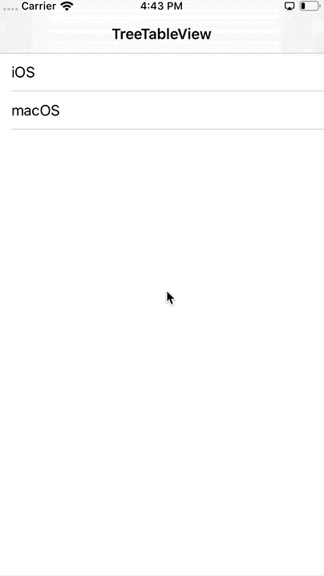

# TreeTableView
[](http://cocoapods.org/pods/TreeTableView)
[](https://github.com/Carthage/Carthage)
[](https://github.com/AntonLisovoy/TreeTableView/blob/master/LICENSE.md)
[](http://cocoapods.org/pods/TreeTableView)
[](https://developer.apple.com/swift/)


## Intoduction
Easiest usage of expandable & collapsible cell for iOS, written in Swift 5. Just provide `UITableViewCell` whatever you like and implement `TreeTableViewDataSource` and `TreeTableViewDelegate` protocols. `TreeTableView` is made because `insertRows` and `deleteRows` is hard to use.



## Usage
### Basic
```swift
import TreeTableView
```

Make `TreeTableView` in Storyboard or in code
```swift
@IBOutlet private weak var treeTableView: TreeTableView!
```

Inherit `TreeTableViewDataSource` and `TreeTableViewDelegate`
```swift
class ViewController: UIViewController, TreeTableViewDataSource, TreeTableViewDelegate
```

Set dataSource and delegate
```swift
treeTableView.treeDataSource = self
treeTableView.treeDelegate = self
```

Implement required `TreeTableViewDataSource` and `TreeTableViewDelegate` methods. See demo project for more information.

## Requirements
`TreeTableView` written in Swift 5.0. Compatible with iOS 9.0+

## Installation

### Cocoapods

TreeTableView is available through [CocoaPods](http://cocoapods.org). To install
it, simply add the following line to your Podfile:

```ruby
pod 'TreeTableView'
```
### Carthage
```
github "AntonLisovoy/TreeTableView"
```

## Contributing
Pull requests are welcome. For major changes, please open an issue first to discuss what you would like to change.

## Author
[Anton Lisovoy](https://twitter.com/AntonLisovoy)

## License
TreeTableView is available under the MIT license. See the LICENSE.md file for more info.
